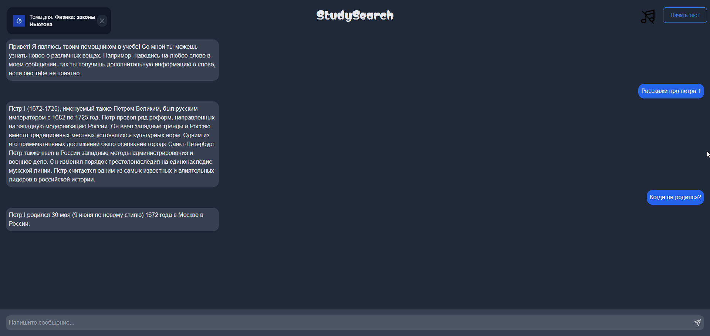
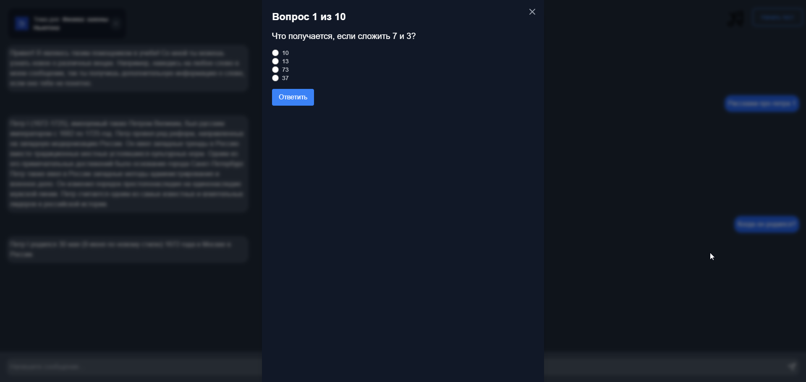

# 🌐 StudySearch

**StudySearch** — это интерактивное образовательное веб-приложение, разработанное для помощи пользователям в изучении различных тем через чат-интерфейс, предоставление информативного контента и функцию тестирования.

## 🚀 Особенности

1. **📅 Тема дня**: Приложение представляет новую тему каждые 24 часа, поддерживая актуальность и привлекательность контента.
   
2. **💬 Чат-интерфейс**: Пользователи могут взаимодействовать с ИИ-ассистентом, задавая вопросы и получая информацию по различным предметам.

3. **ℹ️ Контекстная информация**: При наведении курсора на выделенные слова в ответах ассистента предоставляются дополнительные пояснения или определения.

4. **🎶 Lo-fi музыка**: Пользователи могут включить фоновую lo-fi музыку для создания расслабляющей учебной среды.

5. **📝 Система тестирования**:
   - Прохождение тестов с множественным выбором по выбранным темам.
   - Отслеживание результатов и количества правильных ответов.
   - Возможность повторного прохождения тестов или начала новых по другим темам.

6. **📱 Адаптивный дизайн**: Приложение разработано для удобного использования на устройствах различных размеров.

## 💻 Пользовательский интерфейс

- Основной интерфейс выполнен в тёмной теме для уменьшения нагрузки на глаза 🌙.
- Окно чата отображает историю разговоров и позволяет пользователям вводить новые сообщения 💬.
- Верхняя панель показывает текущую тему дня и содержит навигационные элементы 🧭.
- Интерфейсы тестов появляются в виде модальных окон поверх основного интерфейса чата 📝.

## 🛠️ Технологический стек

- **Фронтенд**: React + Tailwind CSS
- **ИИ-ассистент**: GroqCloud (Mitrax model)

## 🎯 Как пользоваться

1. Откройте приложение, чтобы увидеть тему дня 📅.
2. Взаимодействуйте с ИИ-ассистентом, набирая вопросы или запросы в поле ввода чата 💬.
3. Наведите курсор на выделенные слова в ответах ассистента для получения дополнительной информации ℹ️.
4. Включите/выключите фоновую lo-fi музыку с помощью иконки музыкальной ноты 🎶.
5. Начните тест, нажав кнопку "Начать тест" 📝.
6. Ответьте на вопросы теста и отправьте свои ответы 📊.
7. Просмотрите результаты теста и выберите повторное прохождение или новую тему 🎓.

## 🛠️ Будущие улучшения

- 📚 Расширение базы данных тем.
- 👤 Внедрение пользовательских аккаунтов для отслеживания прогресса.
- 🎨 Добавление более интерактивных элементов и мультимедийного контента.
- 🔢 Введение уровней сложности для тестов.

## 🎨 Снимки экрана

 
 

## 📄 Лицензия

Проект распространяется под лицензией MIT. Подробности можно найти в файле [LICENSE](./LICENSE).
